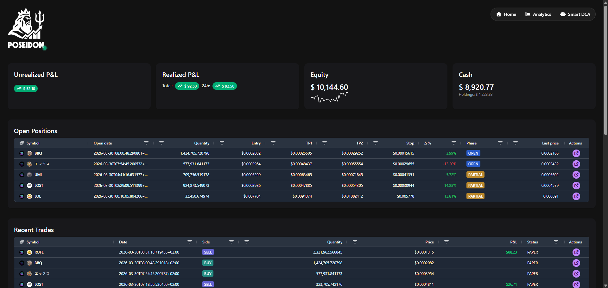
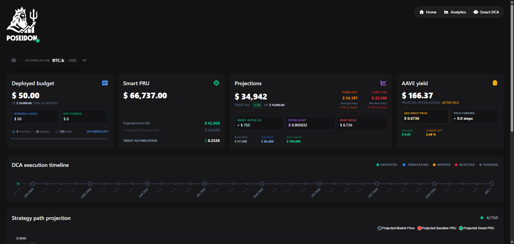
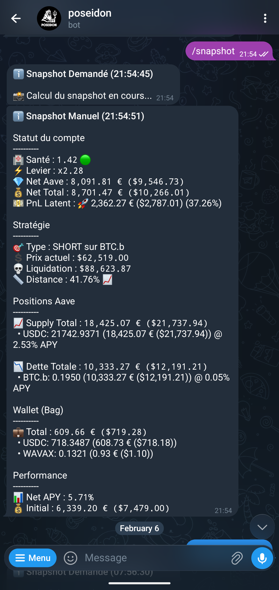

# Poseidon

> ⚠️⚠️⚠️⚠️ **EXPERIMENTAL SOFTWARE - HIGH RISK WARNING** ⚠️⚠️⚠️⚠️
>
> Poseidon is currently in an **ACTIVE DEVELOPMENT (alpha)** stage. It is designed to interact with **real financial assets** and decentralized protocols.
>
> **UNLESS EXPLICITLY TESTED IN `PAPER_MODE`, DO NOT USE THIS SOFTWARE WITH YOUR LIVE FUNDS.**
>
> Use at your own risk. The authors and contributors are not responsible for any financial losses, bugs, or liquidation events. Always start with a dedicated, isolated wallet with minimal funds for initial testing.

---

## 🏛️ System architecture

```text
                      ┌──────────────────────────────────────────────────────────┐
                      │                    POSEIDON FRONTEND                     │
                      └──────────────┬──────────────────────────────┬────────────┘
                                     │                              │
                                     │      REST / WebSockets       │
                                     │                              │
                      ┌──────────────▼──────────────────────────────▼────────────┐
                      │                     POSEIDON BACKEND                     │
                      └──────────────┬──────────────┬──────────────┬─────────────┘
                                     │              │              │
                      ┌──────────────▼──────┐┌──────▼──────┐┌──────▼─────────────┐
                      │   AI STRATEGY HUB   ││  DCA ENGINE ││   LIQUIDITY WATCH  │
                      │   (OpenAI GPT-5)    ││             ││   (Aave Sentinel)  │
                      └──────────────┬──────┘└──────┬──────┘└──────┬─────────────┘
                                     │              │              │
                      ┌──────────────▼──────────────┴──────────────▼─────────────┐
                      │                 MULTI-CHAIN CONNECTOR                    │
                      ├──────────────────────────────┬───────────────────────────┤
                      │  Ethereum / Solana / AVX     │      AAVE PROTOCOL        │
                      │  DexScreener / Li.Fi         │     (Supply/Borrow)       │
                      └──────────────────────────────┴───────────────────────────┘
```

---

## ⚡ Core pillars

### 1. High-Frequency (optionnally AI-powered) trading bot


A multi-chain, highly configurable execution engine designed for speed and precision.

* **AI-driven analysis** (optionnal) : Leverages OpenAI (GPT-5.x mini by default) to perform real-time chart analysis via automated screenshots (Playwright).
* **Multi-chain execution**: Native support for **Ethereum**, **Solana**, and **Avalanche**.
* **Granular configuration**: Advanced momentum scoring, volume monitoring, and liquidity thresholds.
* **Sentiment and trend integration**: Real-time data fetching from DexScreener and custom trend detection algorithms.

### 2. Next-generation DCA (Dollar cost averaging)


Next-generation DCA engine deeply integrated with the **Aave ecosystem**.

* **Advanced indicators**: Uses **EMA50** to defer buys during market overheating and optimize entry points.
* **PRU optimization**: Focuses on **Unit Cost Price** synchronization to ensure long-term profitability.
* **Seamless relooping**: Dynamic management of supply/borrow positions to maximize capital efficiency.

### 3. Aave sentinel (Liquidity watch)


An autonomous monitoring brick dedicated to capital preservation and liquidation prevention.

* **Health factor oversight**: Continuous real-time monitoring of Aave Health Factors.
* **Automated rescue**: Automatically manages collateral and repays debt to maintain safety thresholds.
* **Risk mitigation**: Designed to react faster than human intervention during extreme market volatility.
* **Telegram alerts**: Direct integration for instant notification of critical health status changes.

---

## 🛠️ Technology stack

| Component      | Stack                                             |
|:---------------|:--------------------------------------------------|
| **Frontend**   | Angular 20, PrimeNG 20, TailwindCSS 4, ApexCharts |
| **Backend**    | FastAPI (Python 3.11+), SQLAlchemy 2.0, Alembic, Uvicorn |
| **Automation** | Playwright (headless browser), OpenAI SDK         |
| **Web3**       | Web3.py, Solana-py, Li.Fi integration             |
| **Monitoring** | Telegram Bot API, structured logging with tags    |

---

## 🚀 Getting started

### 1. Environment configuration

Create a `.env` file in the root directory. **Crucial keys are listed below:**

```bash
# === API KEYS ===
OPENAI_API_KEY=your_openai_key_here
TELEGRAM_BOT_TOKEN=your_bot_token
TELEGRAM_CHAT_ID=your_chat_id

# === WALLET ===
WALLET_MNEMONIC="twelve_or_twenty_four_words_wallet_mnemonic"

# === BLOCKCHAIN RPCs ===
EVM_RPC_URL=https://your-eth-rpc-url
SOLANA_RPC_URL=https://your-solana-rpc-url

# === DCA ===
AAVE_INITIAL_DEPOSIT_USD=10000

# === DATABASE ===
DATABASE_NAME=poseidon
DATABASE_USER=poseidon
DATABASE_PASSWORD=change_me
DATABASE_URL="postgresql+psycopg://poseidon:<hostname>@postgres:5432/poseidon"

# === RUNTIME FLAGS ===
TRADING_ENABLED=false
TRADING_SHADOWING_ENABLED=false
DCA_ENABLED=true
AAVE_SENTINEL_ENABLED=false
DATABASE_AUTO_MIGRATE=true

# === PATHS ===
SCREENSHOT_DIR="/app/data/screenshots"

# === TRADING ===
# ⚠️ DANGEROUS SECTION ⚠️
# Activates the trading engine when needed
TRADING_ENABLED=true
```

### 2. Launch with docker

```bash
docker compose up --build
```

The local Docker stack now starts:
- a PostgreSQL service
- a single `poseidon` container built from the root `Dockerfile`
- automatic Alembic migration during container startup
- an internal FastAPI backend proxied by nginx and supervised by `supervisord`

### 3. Production-style single image

For integration / production-style deployments, the repository now ships a single multi-stage `Dockerfile` at the root.

It builds the Angular frontend, packages the FastAPI backend, serves static assets through nginx, launches nginx and the backend through `supervisord`, and expects PostgreSQL to be provided externally.

The generic single-image compose file for remote hosts lives at:

```bash
deploy/docker-compose.integration.yml
```

This file is intentionally generic: the same image can be deployed multiple times with different `.env` files, secrets, flags, and database URLs.

---

## ⚖️ Final disclaimer

> **DO NOT DEPLOY WITHOUT LIVE TESTING IN PAPER MODE.**
> This software is provided "as is", without warranty of any kind. Automated trading involves significant risk of capital loss. The DCA algorithms and AI analysis can fail during extreme market volatility. Ensure your `PAPER_MODE` is set to `true` for at least 48 hours before considering any real-money interactions.